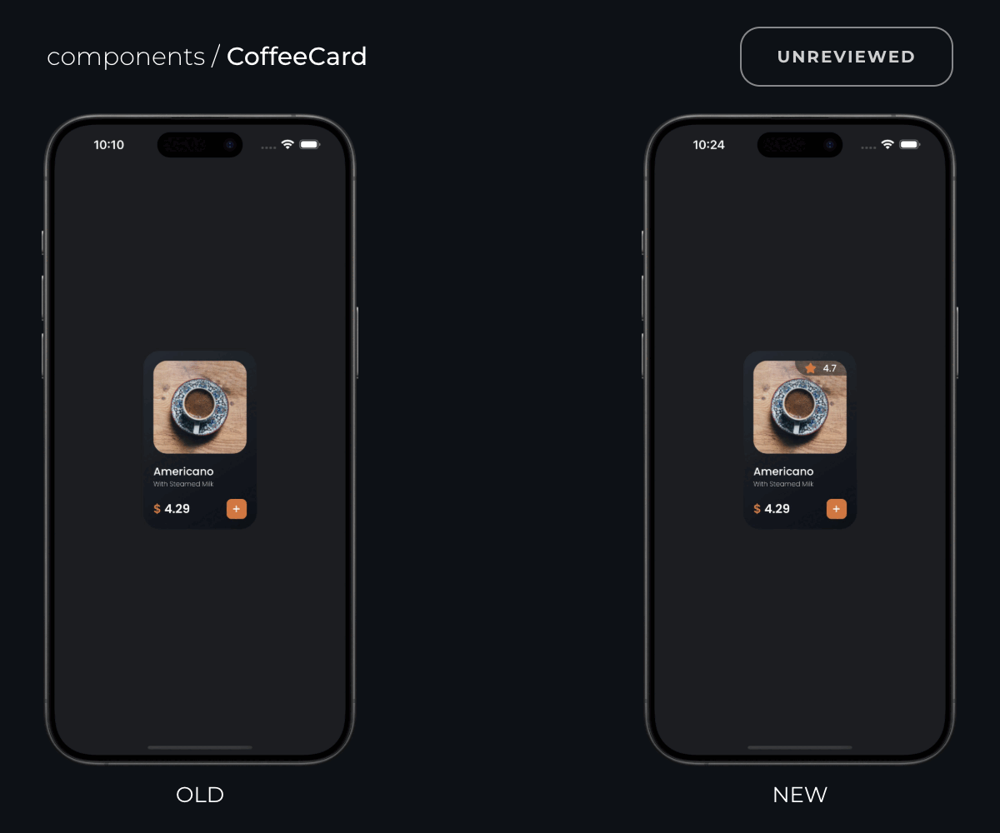
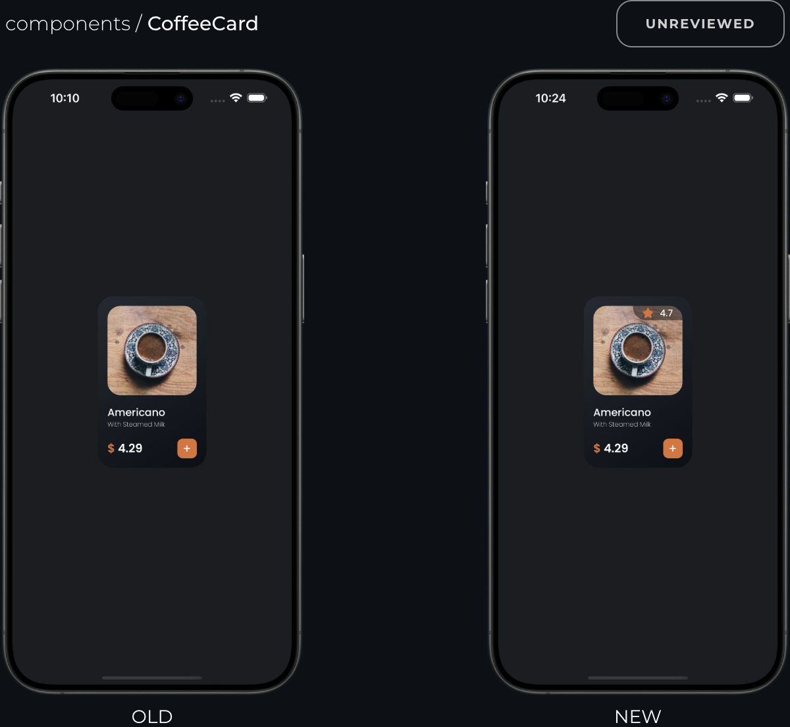
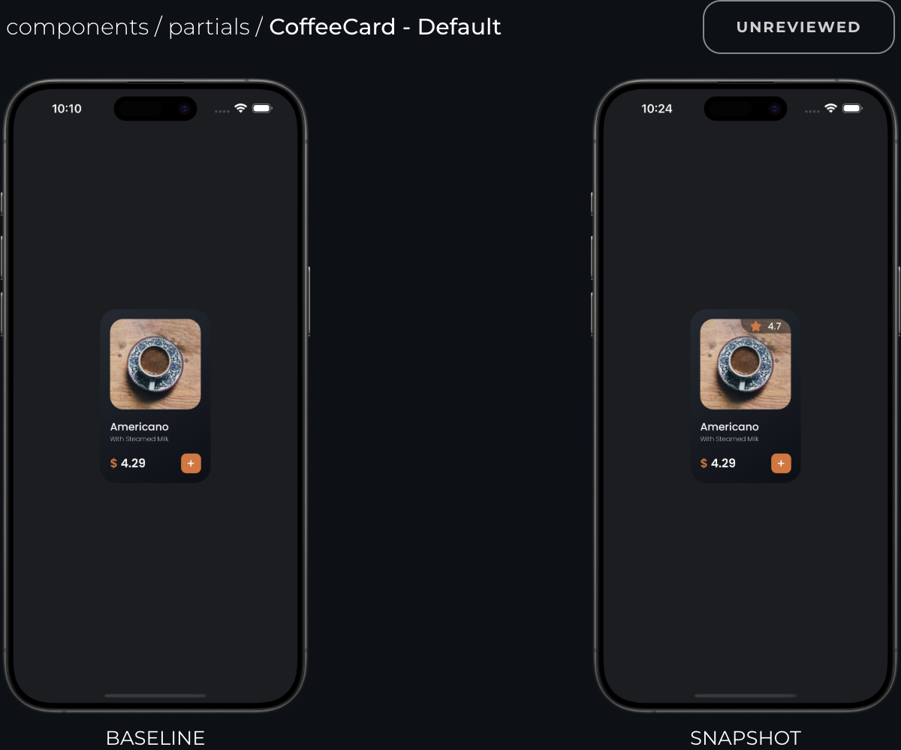

<br />

<p align="center">
  <a href="https://sherlo.io/">
    <picture>
      <source media="(prefers-color-scheme: dark) and (max-width: 480px)" srcset="./assets/logo-dark.svg" width="140">
      <source media="(prefers-color-scheme: dark)" srcset="./assets/logo-dark.svg" width="176">
      <source media="(max-width: 480px)" srcset="./assets/logo-light.svg" width="140">
      
    </picture>
  </a>
</p>

<p align="center">Visual Testing & Review Tool for React Native Storybook</p>

<!-- <br />

<div align="center">
  
</div> -->

<!-- <br />

<div align="center">
  <picture>
    <source media="(prefers-color-scheme: dark) and (max-width: 500px)" srcset="./dark-mobile.gif" width="436">
    <source media="(prefers-color-scheme: dark)" srcset="./dark-desktop.gif" width="600">
    <source media="(max-width: 500px)" srcset="./assets/logo-light.svg" width="140">
    
  </picture>
</div> -->

<br />

<div align="center">
  
</div>

<!-- <br />

<div align="center">
  
</div> -->

<br />

<div align="center">
  
</div>

# Sherlo

Test your UI on iOS and Android automatically in the cloud. Built for React Native Storybook.

### Key Benefits

- **🖼️ Ensure Pixel Perfection** – Your UI, exactly as designed
- **📱 Real Mobile Testing** – Native iOS & Android testing - not web-based solutions like React Native Web
- **☁️ Visual Testing Cloud** – You build, we test - on infrastructure built specifically for mobile UI testing
- **🤝 Team-Friendly Review** – One web app for your whole team
- **✅ Ship with Confidence** – Merge with peace of mind - see exactly what changed
- **⏱️ Save Manual QA Hours** – Forget device-by-device checks - every UI update caught automatically

<br />

## Web App + Demo

Review visual changes across devices in one web app as a team - from developers to designers.

### Features

- **📸 Visual Diff Comparison** – Compare before/after screenshots with highlighted changes
- **💬 Team Feedback** – Approve or reject changes with comments
- **🔍 Code Inspector** – Inspect React Native styles directly in the browser
- **🎨 Figma Integration** – Compare UI with Figma designs side-by-side
- **…and more**

**🚀 [Try the Demo](https://app.sherlo.io/demo)** to see these features in action

<br />

<!-- TODO: opakowac w frame z "przegladarki" jak na LP -->
<div align="center">
  
</div>

<br />

## Quick Start

#### 1) Install Sherlo

```bash
npx sherlo@latest init
```

#### 2)<sup>\*</sup> Optionally customize your [test devices](https://docs.sherlo.io/setup/config#devices) _(example)_

<!-- prettier-ignore -->
```json
[
  { "id": "iphone.15", "osVersion": "17", "osTheme": "dark" },
  { "id": "pixel.tablet", "osVersion": "13", "osLocale": "en_GB", "osFontScale": "+1" }
]
```

#### 3) Run your first test

```bash
npx sherlo test
```

🎉 **That's it!** Your visual testing is ready.

<br />

[Full documentation →](https://docs.sherlo.io/setup/integration)

<br />

## How It Works

1. **📸 Capture** – Sherlo runs your Storybook stories on iOS and Android simulators

2. **🔍 Compare** – Screenshots are compared against previous versions to detect visual changes

3. **👀 Review** – Your team reviews visual changes before they go live

4. **🚢 Ship** – Deploy with confidence knowing your UI is rock-solid

<br />

## New to Storybook?

**🏗️ Build in Isolation** – No need to run the full app or navigate through screens

**📚 Living Docs** – UI library created automatically while coding

**💖 Perfect with Sherlo** – Your existing stories automatically become visual tests across iOS & Android

<br />

[Learn more about Storybook →](https://github.com/storybookjs/react-native)

<br />

## Links

**🚀 [Try Demo](https://app.sherlo.io/demo)** – See Sherlo in action  
**📖 [Documentation](https://docs.sherlo.io/)** – Setup guides and API reference  
**🌐 [Main Website](https://sherlo.io/)** – Learn more about Sherlo  
**💬 [Join Discord](https://discord.com/invite/G7eqTBkWZt)** – Get help from the community  
**🐦 [Follow on X](https://x.com/sherlo_io)** – Latest updates and tips  
**⭐ [Star on GitHub](https://github.com/sherlo-io/sherlo)** – Support the project

**📧 Questions?** contact@sherlo.io

<br />

## Links

### 🚀 Get Started

- **[Try Demo](https://app.sherlo.io/demo)** – See visual testing in action
- **[Documentation](https://docs.sherlo.io/)** – Complete setup guide
- **[Main Website](https://sherlo.io/)** – Pricing and features

### 🤝 Community

- **[Discord](https://discord.com/invite/G7eqTBkWZt)** – Join 500+ developers using Sherlo
- **[X/Twitter](https://x.com/sherlo_io)** – Updates and React Native tips
- **[GitHub](https://github.com/sherlo-io/sherlo)** – ⭐ Star us if Sherlo helps your team!

### 📧 Contact

**contact@sherlo.io** – Questions, feedback, or enterprise needs

<br />

## Links

| Resource                                             | Description                  | Action     |
| ---------------------------------------------------- | ---------------------------- | ---------- |
| **[Demo](https://app.sherlo.io/demo)**               | See Sherlo in action         | 🚀 Try now |
| **[Docs](https://docs.sherlo.io/)**                  | Setup guides & API reference | 📖 Read    |
| **[Website](https://sherlo.io/)**                    | Pricing and features         | 🌐 Visit   |
| **[Discord](https://discord.com/invite/G7eqTBkWZt)** | Community of 500+ developers | 💬 Join    |
| **[X/Twitter](https://x.com/sherlo_io)**             | Latest updates and tips      | 🐦 Follow  |
| **[GitHub](https://github.com/sherlo-io/sherlo)**    | Source code and issues       | ⭐ Star    |

**📧 Contact:** contact@sherlo.io

<br />

## Links

**🚀 [Try Demo](https://app.sherlo.io/demo)** – See visual testing in action  
**📖 [Documentation](https://docs.sherlo.io/)** – Complete setup guide  
**🐦 [Follow us on X](https://x.com/sherlo_io)** – React Native tips and updates

**⭐ Star this repo** if Sherlo helps your team ship better UI!  
**💬 Join our [Discord community](https://discord.com/invite/G7eqTBkWZt)** – 500+ React Native developers  
**📧 Questions or feedback?** Reach us at contact@sherlo.io

<br />

## Links

**[🚀 Demo](https://app.sherlo.io/demo)** – See it in action  
**[📖 Docs](https://docs.sherlo.io/)** – Setup guides & API reference  
**[🐦 Twitter](https://x.com/sherlo_io)** – Updates and React Native tips

---

**Enjoying Sherlo?** ⭐ Star this repo to show support!  
**Need help?** Join our [Discord](https://discord.com/invite/G7eqTBkWZt) community  
**Got questions?** Email us at contact@sherlo.io

<br />

## Links

- **[Demo](https://app.sherlo.io/demo)** – Try Sherlo in action
- **[Documentation](https://docs.sherlo.io/)** – Setup guides
- **[X/Twitter](https://x.com/sherlo_io)** – Updates & tips

⭐ **Star us on GitHub** if this helps your team!  
💬 **[Join Discord](https://discord.com/invite/G7eqTBkWZt)** for community support  
📧 **Contact:** contact@sherlo.io

---

<p align="center">
  Made with ❤️ by the Sherlo team
  <br>
  <a href="https://sherlo.io">Website</a> • 
  <a href="https://docs.sherlo.io">Docs</a> • 
  <a href="https://twitter.com/sherlo_io">Twitter</a> • 
  <a href="https://discord.gg/sherlo">Discord</a>
</p>
