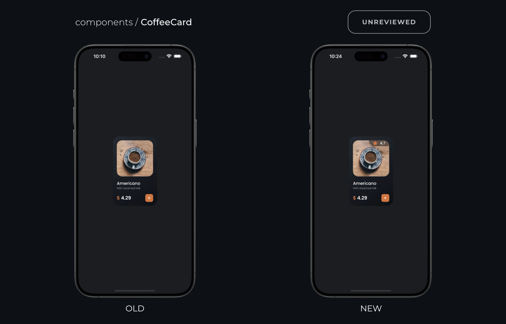
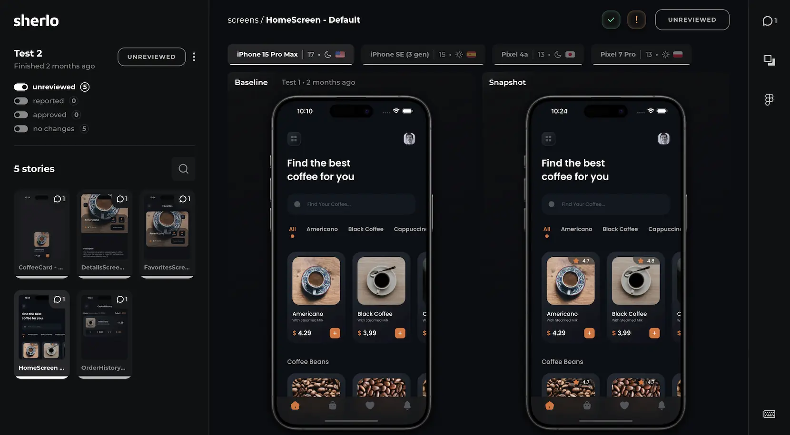

  <a href="https://sherlo.io/">
    <picture>
      <source media="(prefers-color-scheme: dark)" srcset="./assets/logo-dark.svg">
      
    </picture>
  </a>

Visual testing & review tool for React Native <em>(Storybook)</em>

 

  

# Sherlo

Sherlo is a Cloud-based Visual Testing and Review Tool that integrates with React Native Storybook. Designed to detect every change in your UI components, Sherlo empowers your team to confidently release apps with no visual bugs. Discover more on the Sherlo website

 

## ✨ Key Benefits

- **🖼️ Ensure Pixel Perfection** — Your UI, exactly as designed - with pixel precision
- **📱 Real Mobile Testing** — Native iOS & Android testing - not browser approximations like React Native Web
- **☁️ Visual Testing Cloud** — You build, we test - on cloud infrastructure designed for mobile UI testing
- **🤝 Team-Friendly Review** — One web app, for your whole team - review visual changes together
- **✅ Ship with Confidence** — Merge with peace of mind - know exactly what changed, every time
- **⏱️ Save Manual QA Hours** — Forget device-by-device checks - every UI change, caught for you

 

## 🖥️ Web App + Demo

Sherlo app shows visual diffs across iOS & Android and lets your team review them before merge.

### Key actions

- Browse test runs and screenshots per device
- Accept or reject pixel diffs
- Add comments in context
- Compare UI with its Figma design
- Open Code Inspector to view React Native styles
- …and more

👉 [Open Demo](https://app.sherlo.io/demo)

  

