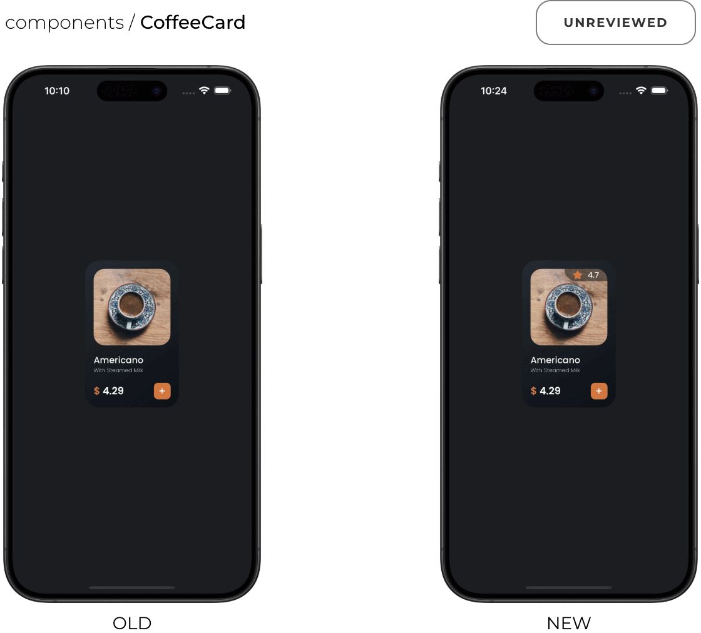

<br />

<p align="center">
  <a href="https://sherlo.io/">
    <picture>
      <source media="(prefers-color-scheme: dark) and (max-width: 500px)" srcset="./assets/logo-dark.svg" width="140">
      <source media="(prefers-color-scheme: dark)" srcset="./assets/logo-dark.svg" width="176">
      <source media="(max-width: 500px)" srcset="./assets/logo-light.svg" width="140">
      
    </picture>
  </a>
</p>

<p align="center">Visual Testing & Review Tool for React Native Storybook</p>

<br />

<div align="center">
  <picture>
    <source media="(prefers-color-scheme: dark) and (max-width: 500px)" srcset="./assets/hero-mobile-dark.gif" width="436">
    <source media="(max-width: 500px)" srcset="./assets/hero-mobile-light.gif" width="436">
    <source media="(prefers-color-scheme: dark)" srcset="./assets/hero-desktop-dark.gif" width="560">
    
  </picture>
</div>

# Sherlo

Test your UI on iOS and Android automatically in the cloud. Built for React Native Storybook.

### How It Works

1. **📸 Capture** – Sherlo takes screenshots of your UI on iOS and Android devices in the cloud
2. **🔍 Detect** – All visual changes are automatically detected by comparison with previous versions
3. **👍 Review** – Your team reviews detected changes before they go live

### Key Benefits

- **🖼️ Ensure Pixel Perfection** – Your UI, exactly as designed
- **✅ Ship with Confidence** – Merge with peace of mind - see exactly what changed
- **⏱️ Save Manual QA Hours** – Forget device-by-device checks - every UI update caught automatically
- **🤝 Team-Friendly Review** – One web app for your whole team
- **📱 Real Mobile Testing** – Native iOS & Android testing - not web-based solutions like React Native Web
- **☁️ Visual Testing Cloud** – You build, we test - on infrastructure built specifically for mobile UI testing

<br />

## Quick Start

#### 1) Install Sherlo

```bash
npx sherlo@latest init
```

#### 2)<sup>\*</sup> Customize your [test devices](https://docs.sherlo.io/setup/config#devices) _(optional)_

<!-- prettier-ignore -->
```json
[
  { "id": "iphone.15", "osVersion": "17", "osTheme": "dark" },
  { "id": "pixel.tablet", "osVersion": "13", "osLocale": "en_GB", "osFontScale": "+1" }
]
```

#### 3) Run your first test

```bash
npx sherlo test
```

🎉 **That's it!** Your visual testing is ready.

<br />

[Full documentation →](https://docs.sherlo.io/setup/integration)

<br />

## Web App + Demo

Review visual changes across devices in one web app as a team - from developers to designers.

### Features

- **📸 Visual Diff Comparison** – Compare before/after screenshots with highlighted changes
- **💬 Team Feedback** – Approve or reject changes with comments
- **🔍 Code Inspector** – Inspect React Native styles directly in the browser
- **🎨 Figma Integration** – Compare UI with Figma designs side-by-side
- **…and more**

**🚀 [Try the Demo](https://app.sherlo.io/demo)** to see these features in action

<br />

<div align="center">
  
</div>

<br />

## New to Storybook?

**🏗️ Build in Isolation** – No need to run the full app or navigate through screens

**📚 Auto Docs** – Write once, get both components and documentation

<!-- **💖 Perfect with Sherlo** – Plug in and your components turn into visual tests automatically - zero extra effort -->

**💖 Perfect with Sherlo** – Plug in and get iOS & Android visual tests automatically - zero extra effort

<br />

<!-- [Learn more →](https://storybook.js.org/) -->

<!-- [Storybook website](https://storybook.js.org/) • [Storybook for React Native](https://github.com/storybookjs/react-native) -->

[Storybook for React Native →](https://github.com/storybookjs/react-native)

<br />

## Join the Community

💬 [Join our Discord](https://discord.com/invite/G7eqTBkWZt) – Get help and chat with the community

📢 [Follow us on X](https://x.com/sherlo_io) – Latest updates and React Native tips

📧 Questions? Reach us at contact@sherlo.io

<br />

---

<div align="center">
  <strong>⭐ Star this repo</strong> to support the project!
</div>

---

<br />

<div align="center">
  Made with ❤️ by <a href="https://devine.team">Devine</a> team
  <br />
  <a href="https://sherlo.io">Website</a> • 
  <a href="https://app.sherlo.io">App</a> • 
  <a href="https://app.sherlo.io/demo">Demo</a> • 
  <a href="https://docs.sherlo.io">Docs</a>
</div>

<br />
